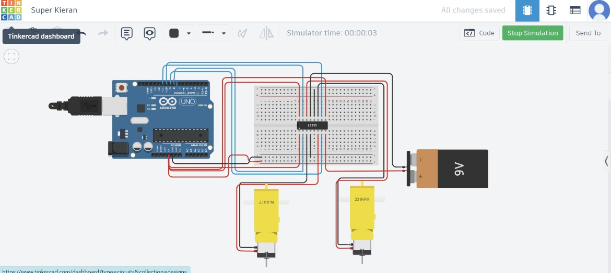

# HBridge with DC Motor Control Project

## Description
This project demonstrates how to control two DC motors using an L293D H-bridge and an Arduino. It includes both a real-world implementation and a Tinkercad simulation.

## Hardware Setup

### Components Used
- Arduino Uno R3
- L293D H-bridge
- 2 DC Motors
- 9V Battery
- Connecting Wires

### Arduino Code
```cpp
// the setup function runs once when you press reset or power the board
void setup() {
  // initialize digital pin LED_BUILTIN as an output.
  pinMode(LED_BUILTIN, OUTPUT);
}

// the loop function runs over and over again forever
void loop() {
  digitalWrite(LED_BUILTIN, HIGH);   // turn the LED on (HIGH is the voltage level)
  delay(1000);                       // wait for a second
  digitalWrite(LED_BUILTIN, LOW);    // turn the LED off by making the voltage LOW
  delay(1000);                       // wait for a second
}
```
### Circuit Diagram


Click [here] to watch the video of how the circle moved (582B8283-80AD-4E03-98CE-8BB0604BBF00.gif)

## Tinkercad Simulation

### Steps in Tinkercad
- Log into Tinkercad and create a new circuit.
- Add the following components: Arduino Uno R3, L293D H-bridge, 2 DC Motors, 9V Battery, Breadboard, Wires.

### Circuit Connections
- Pin 1 (Enable 1,2) to 5V on the Arduino.
- Pin 2 (Input 1) to digital pin 8 on the Arduino.
- Pin 3 (Output 1) to one terminal of the first DC motor.
- Pin 4 and Pin 5 (Ground) to the ground rail on the breadboard.
- Pin 6 (Output 2) to the other terminal of the first DC motor.
- Pin 7 (Input 2) to digital pin 9 on the Arduino.
- Pin 8 (Vcc2, Motor Voltage) to the positive terminal of the 9V battery.
- Pin 9 (Enable 3,4) to 5V on the Arduino.
- Pin 10 (Input 3) to digital pin 10 on the Arduino.
- Pin 11 (Output 3) to one terminal of the second DC motor.
- Pin 12 and Pin 13 (Ground) to the ground rail on the breadboard.
- Pin 14 (Output 4) to the other terminal of the second DC motor.
- Pin 15 (Input 4) to digital pin 11 on the Arduino.
- Pin 16 (Vcc1, Logic Voltage) to 5V on the Arduino.

### Code (Simulation)
```cpp
#define IN1 8
#define IN2 9
#define IN3 10
#define IN4 11

void setup() {
  pinMode(IN1, OUTPUT);
  pinMode(IN2, OUTPUT);
  pinMode(IN3, OUTPUT);
  pinMode(IN4, OUTPUT);
}

void loop() {
  digitalWrite(IN1, HIGH);
  digitalWrite(IN2, LOW);
  digitalWrite(IN3, HIGH);
  digitalWrite(IN4, LOW);
  delay(2000);

  digitalWrite(IN1, LOW);
  digitalWrite(IN2, LOW);
  digitalWrite(IN3, LOW);
  digitalWrite(IN4, LOW);
  delay(1000);

  digitalWrite(IN1, LOW);
  digitalWrite(IN2, HIGH);
  digitalWrite(IN3, LOW);
  digitalWrite(IN4, HIGH);
  delay(2000);

  digitalWrite(IN1, LOW);
  digitalWrite(IN2, LOW);
  digitalWrite(IN3, LOW);
  digitalWrite(IN4, LOW);
  delay(1000);
}
```
### Photos and Link



[Tinkercad Link](https://www.tinkercad.com/things/hCQ08bTzFia-super-kieran/editel?sharecode=cCyNU0ln3ihFzK4wcWK-4WQnTqcPSeFNZldVNa9TJac)

