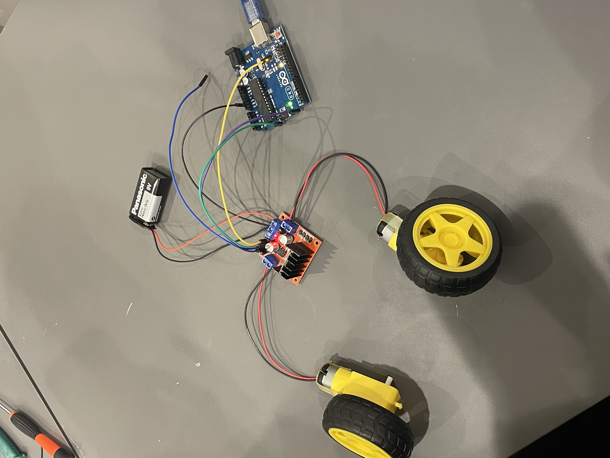

# HBridge with DC Motor Control Project

## Description
This project demonstrates how to control two DC motors using an L293D H-bridge and an Arduino. It includes both a real-world implementation and a Tinkercad simulation.

## Hardware Setup

### Components Used
- Arduino Uno R3
- L293D H-bridge
- 2 DC Motors
- 9V Battery
- Connecting Wires

### Arduino Code
```cpp
// the setup function runs once when you press reset or power the board
void setup() {
  // initialize digital pin LED_BUILTIN as an output.
  pinMode(LED_BUILTIN, OUTPUT);
}

// the loop function runs over and over again forever
void loop() {
  digitalWrite(LED_BUILTIN, HIGH);   // turn the LED on (HIGH is the voltage level)
  delay(1000);                       // wait for a second
  digitalWrite(LED_BUILTIN, LOW);    // turn the LED off by making the voltage LOW
  delay(1000);                       // wait for a second
}
```
### Circuit Diagram




## Tinkercad Simulation
